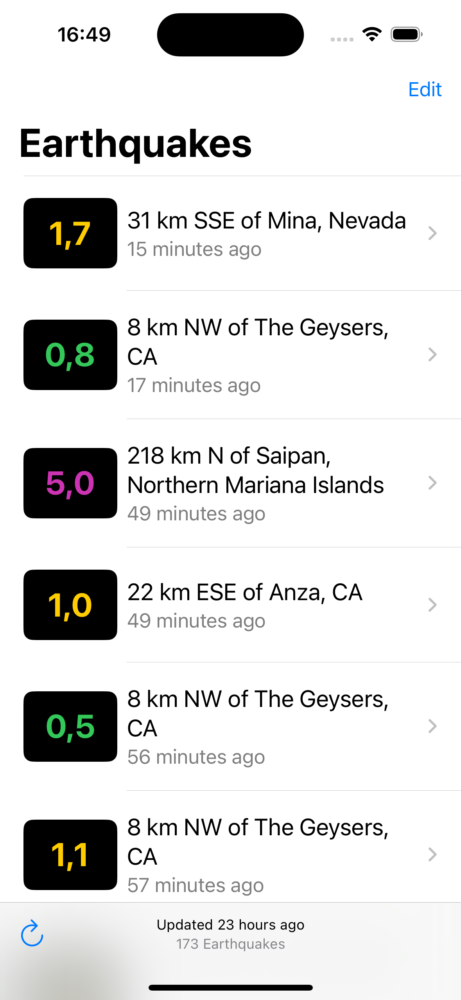
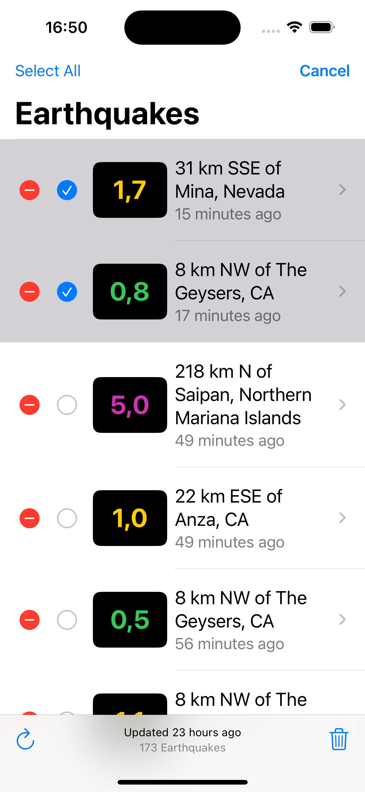
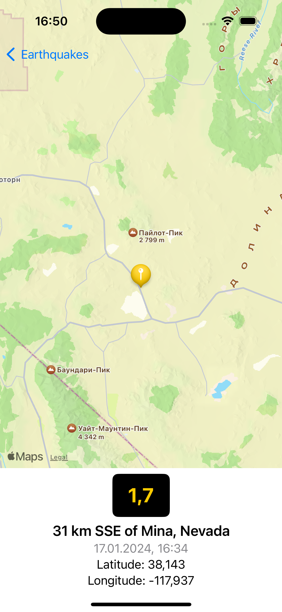
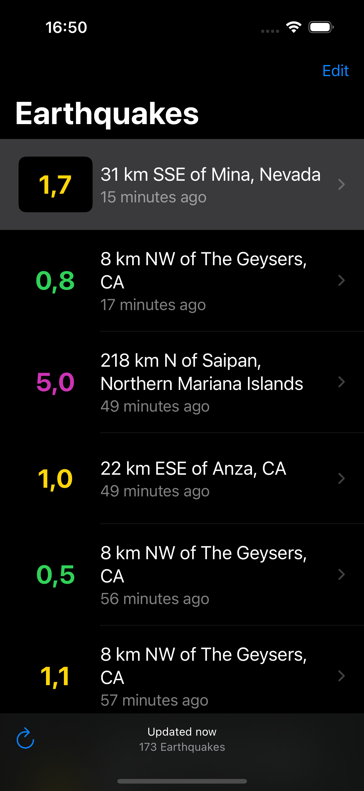
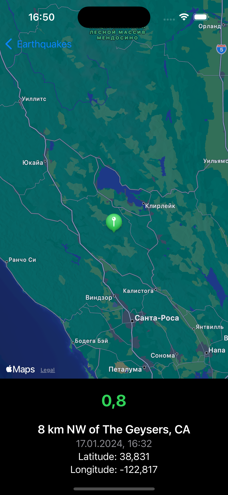

# Earthquakes

This app fetch and represents data about quakes from [_The United States Geological Survey (USGS)_](https://earthquake.usgs.gov/fdsnws/event/1/). On main screen user can reload data and delete individual earthquakes. On detail view shown location of earthquakes on map and detail info about them.
This project contains Network Layer for getting data from API and Unit tests for testing data from service.

 

This project was created according to Apple's tutorials.
